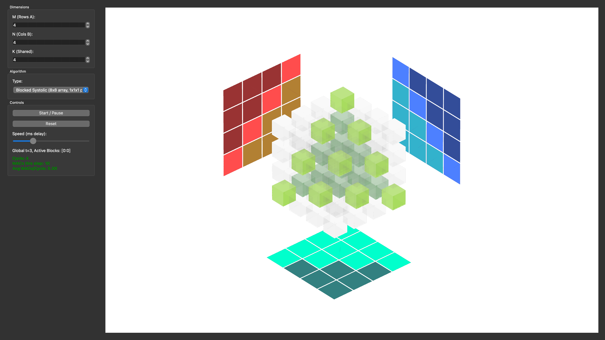

# VisualMatmul - 3D Matrix Multiplication Visualizer

[English](#english) | [中文](#chinese)

**VisualMatmul** is an interactive 3D visualization tool for understanding Matrix Multiplication algorithms and hardware realizations such as systolic arrays and tensor cores. Built with Python, PyQt6, and OpenGL (via pyqtgraph), it renders the computation space as a 3D cube, visualizing how different algorithms (Naive, Tiled, and Systolic variants) traverse and access data in the M, N, and K dimensions.



## Features

- **3D Visualization**:
  - **Center Volume**: Represents the iteration space (M x N x K). Each voxel corresponds to a Multiply-Accumulate (MAC) operation.
  - **Projections**:
    - **Wall A (Red)**: Visualization of Input Matrix A access patterns.
    - **Wall B (Blue)**: Visualization of Input Matrix B access patterns.
    - **Ceiling C (Cyan)**: Real-time update of the Output Matrix C.
- **Algorithms**:
  - **Naive**: Supports various loop orders (ijk, ikj, jki, etc.) to demonstrate memory access locality.
  - **Tiled**: Visualizes Blocked Matrix Multiplication (e.g., 2x2x2 tiles) to demonstrate cache blocking concepts.
- **Interactive Controls**:
  - Adjustable Matrix Dimensions (M, N, K) up to 512 (Performance depends on hardware).
  - Variable Animation Speed.
  - Play/Pause/Reset controls.
  - 3D Camera Control (Rotate/Zoom).

## Installation

### Prerequisites
- Python 3.9+

### Setup

1. **Clone the repository**
   ```bash
   git clone https://github.com/yourusername/VisualMatmul.git
   cd VisualMatmul
   ```

2. **Create a Virtual Environment (Recommended)**
   ```bash
   python -m venv .venv
   source .venv/bin/activate  # On Windows: .venv\Scripts\activate
   ```

3. **Install Dependencies**
   ```bash
   pip install -r requirements.txt
   ```
   *Dependencies include: `PyQt6`, `pyqtgraph`, `numpy`, `PyOpenGL`.*

## Usage

Run the main application:

```bash
python src/main.py
```

- **Dimensions**: Set M, N, K sizes in the left panel. (Start small, e.g., 8x8x8).
- **Algorithm**: Choose between Naive (different orders) or Tiled.
- **Controls**: Click "Start" to begin the animation. Use the slider to adjust speed.
- **View**: Drag left mouse button to rotate, right mouse button (or scroll) to zoom.
- **Shortcuts**:
  - `Space`: toggle play/pause.
  - `F`: advance one frame while paused (also works directly from the visualization pane).

---

<a id="chinese"></a>
# VisualMatmul - 3D 矩阵乘法可视化工具

**VisualMatmul** 是一个用于理解矩阵乘法算法及其硬件实现（如脉动阵列、Tensor Core）的交互式 3D 可视化工具。基于 Python、PyQt6 和 OpenGL (pyqtgraph) 构建。它将计算过程渲染为一个 3D 立方体，直观地展示了不同算法（如朴素算法、分块算法和脉动变体）如何在 M、N、K 维度上遍历和访问数据。

## 功能特性

- **3D 可视化视图**:
  - **中心立方体**: 代表迭代空间 (M x N x K)。每个体素对应一次乘加 (MAC) 运算。
  - **投影视图**:
    - **A 面 (红色)**: 输入矩阵 A 的访问模式投影。
    - **B 面 (蓝色)**: 输入矩阵 B 的访问模式投影。
    - **C 面 (青色)**: 输出矩阵 C 的实时更新投影。
- **支持算法**:
  - **朴素算法 (Naive)**: 支持多种循环顺序 (ijk, ikj, jki 等)，用于演示内存访问局部性。
  - **分块算法 (Tiled)**: 可视化分块矩阵乘法（如 2x2x2 块），演示缓存分块 (Cache Blocking) 概念。
- **交互控制**:
  - 动态调整矩阵维度 (M, N, K)，支持至 512 (性能取决于硬件)。
  - 可调节动画速度。
  - 开始/暂停/重置控制。
  - 3D 相机控制（旋转/缩放）。

## 安装说明

### 前置要求
- Python 3.9+

### 安装步骤

1. **克隆仓库**
   ```bash
   git clone https://github.com/yourusername/VisualMatmul.git
   cd VisualMatmul
   ```

2. **创建虚拟环境（推荐）**
   ```bash
   python -m venv .venv
   source .venv/bin/activate  # Windows 用户: .venv\Scripts\activate
   ```

3. **安装依赖**
   ```bash
   pip install -r requirements.txt
   ```

## 使用方法

运行主程序：

```bash
python src/main.py
```

- **维度设置**: 在左侧面板设置 M, N, K 大小。（建议从小规模开始，例如 8x8x8）。
- **算法选择**: 选择 Naive（不同顺序）或 Tiled。
- **控制**: 点击 "Start" 开始动画。使用滑块调整速度。
- **视角**: 左键拖动旋转，右键拖动（或滚轮）缩放。
- **快捷键**:
  - `Space`: 播放/暂停。
  - `F`: 在暂停状态下前进一步。

